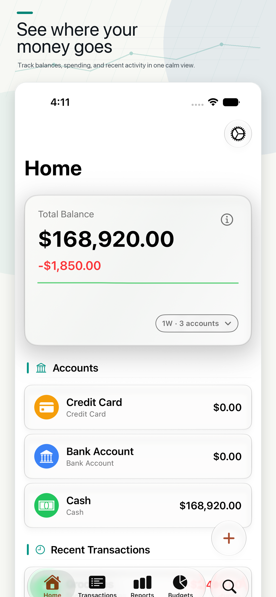
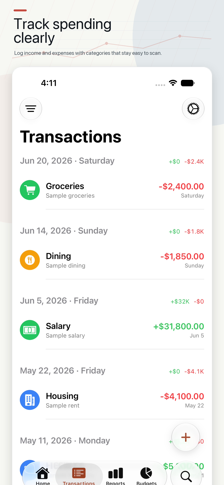
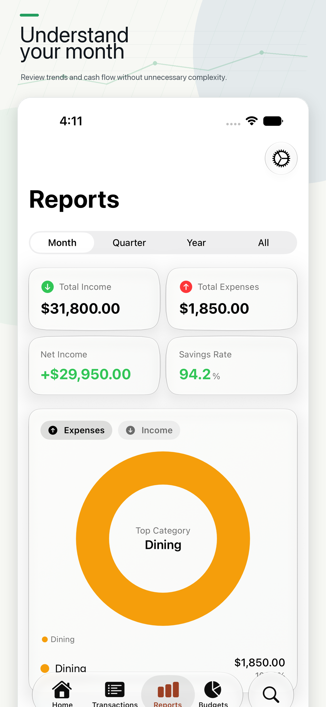
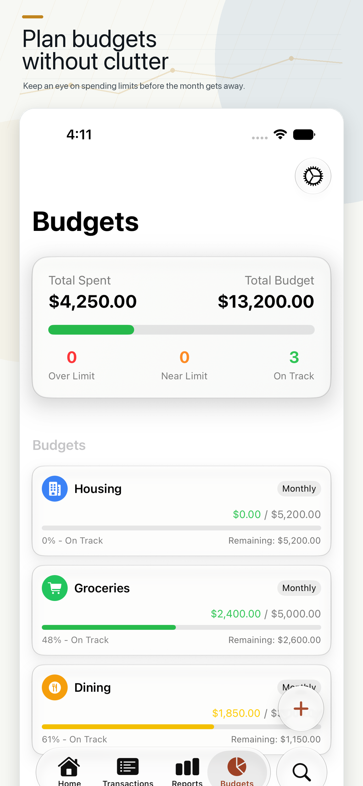
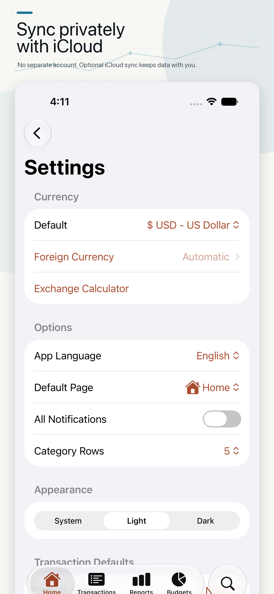

<div align="center">
  
  <h1>Daily Sum</h1>
  <p><strong>A clearer view of your everyday money.</strong></p>
  <p>Track spending, manage accounts, and plan budgets in a native iPhone app.</p>
  <p>
    <a href="https://apps.apple.com/app/id6759169500">Download on the App Store</a> ·
    <a href="#screenshots">Screenshots</a> ·
    <a href="#build-from-source">Build from source</a> ·
    <a href="https://treantprotectorgo.github.io/flux-privacy-policy/">Privacy policy</a>
  </p>
  <p>
    
    
    <a href="LICENSE"></a>
  </p>
</div>

Daily Sum is a personal finance app for recording income and expenses, understanding spending patterns, and keeping accounts organized. Enter transactions yourself without connecting a bank account, then explore your balances, reports, and budgets in one place.

Available on the [App Store as **Daily Sum: Money Tracker**](https://apps.apple.com/app/id6759169500). **Flux** is the source repository and Xcode project name.

## Screenshots

<table>
  <tr>
    <td width="33%"></td>
    <td width="33%"></td>
    <td width="33%"></td>
  </tr>
  <tr>
    <td align="center">Your money at a glance</td>
    <td align="center">Every transaction in view</td>
    <td align="center">Understand your spending</td>
  </tr>
</table>

<details>
  <summary>See budgets and settings</summary>
  <p>
    
    
  </p>
</details>

*App Store promotional screenshots with sample data. The current source may include newer interface changes.*

## Features

- **Everyday tracking** — Record income, expenses, and transfers with categories, notes, and recurring schedules.
- **Multiple accounts** — Organize balances across cash, bank accounts, credit cards, and custom account types.
- **Budgets and reports** — Set spending limits, monitor progress, and explore category breakdowns and balance trends.
- **Travel currencies** — Work with multiple currencies and use the built-in exchange calculator.
- **Backups and export** — Back up and restore your data, configure automatic backups, and export transactions to CSV.
- **Optional iCloud sync** — Keep data in your private CloudKit database when sync is enabled.
- **Quick access** — Start transaction entry through App Shortcuts, supported Action Buttons, and Control Center controls.
- **Make it yours** — Choose light or dark appearance, customize categories, and use English, Traditional Chinese, or Simplified Chinese.

## Data and privacy

Daily Sum stores records locally with SwiftData and offers optional iCloud sync. No bank login is required. Location access supports selecting a local travel currency, and notifications support reminders and budget alerts.

Read the [privacy policy](https://treantprotectorgo.github.io/flux-privacy-policy/) for details.

## Build from source

### Requirements

- macOS with Xcode and an iOS SDK supporting **iOS 26.2 or later**.
- An iPhone simulator or a compatible iPhone.
- Your own Apple development signing configuration for physical-device builds and iCloud capabilities.

### Run locally

```sh
git clone https://github.com/TreantProtectorGo/Flux.git
cd Flux
open Flux.xcodeproj
```

1. Select the **Flux** scheme and an iPhone simulator running iOS 26.2 or later.
2. For development, set **Edit Scheme → Run → Build Configuration** to **Debug**. The checked-in scheme currently uses Release for Run.
3. Build and run with **⌘R**.

For a physical device, select your development team and unique bundle identifiers for both the **Flux** app and **DailySumControls** extension under **Signing & Capabilities**. To use iCloud in your own build, configure a container you control and update both [Flux.entitlements](Flux/Flux.entitlements) and the identifier in [ModelContainerConfiguration.swift](Flux/Utilities/ModelContainerConfiguration.swift).

### Tests

Run the unit and UI test suites with **⌘U** in Xcode. For command-line testing, list the available destinations and use a simulator ID from the output:

```sh
xcodebuild -showdestinations -project Flux.xcodeproj -scheme Flux

xcodebuild test \
  -project Flux.xcodeproj \
  -scheme Flux \
  -configuration Debug \
  -destination 'platform=iOS Simulator,id=<SIMULATOR_ID>'
```

Tests cover transaction behavior, currency conversion, backup and restore, CSV export, localization, and UI flows.

## Project structure

| Path | Purpose |
| --- | --- |
| `Flux/Views` and `Flux/Components` | SwiftUI screens and reusable interface components |
| `Flux/ViewModels` | Screen state and presentation logic |
| `Flux/Models` | SwiftData models and domain types |
| `Flux/Services` | Transactions, budgets, exchange rates, sync settings, and exports |
| `Flux/Backup` | Backup archives, encoding, and import reports |
| `Flux/Utilities` | Localization, formatting, migrations, and app lifecycle support |
| `DailySumControls` and `SharedAppIntents` | Control Center controls and shared intents |
| `FluxTests` and `FluxUITests` | Unit tests and UI automation |
| `marketing` | App Store screenshot tooling and README images |

Built with **SwiftUI**, **SwiftData**, **Swift Charts**, **CloudKit**, **WidgetKit**, and **App Intents**.

## Contributing

Bug reports and focused pull requests are welcome. [Open an issue](https://github.com/TreantProtectorGo/Flux/issues) with reproduction steps, your iOS version, and screenshots where useful. Use sample data in screenshots and attachments.

For code changes, describe the behavior being changed, run the relevant tests, and include screenshots for interface updates. Keep user-facing strings localized across the supported languages.

## License

Distributed under the [MIT License](LICENSE). Copyright © 2026 Wing Sum LEE.
